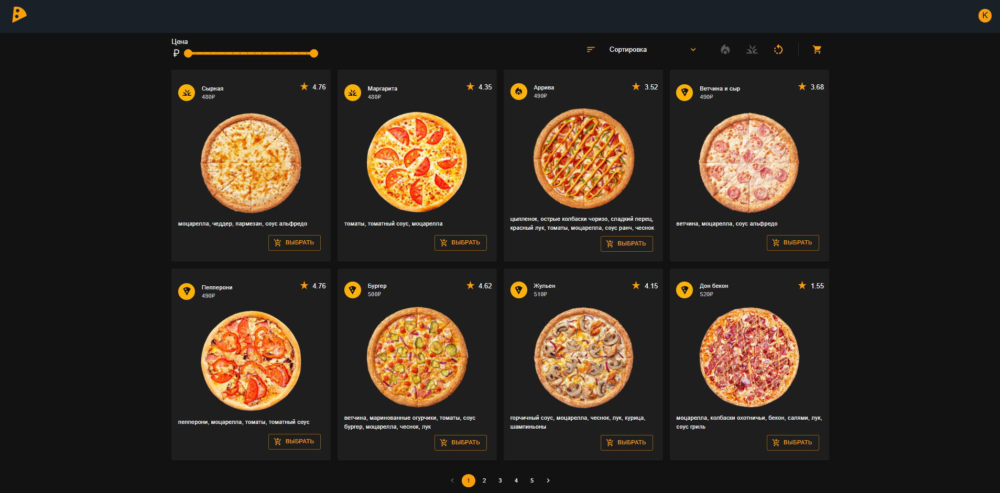
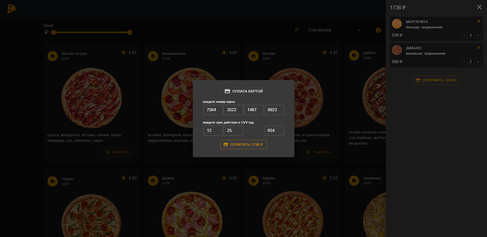

# pizza store




Features:
* filter by price, props (hot pizza, vegetarian), button reset filter
* sorting by price (ASC and DESC), rating
* pagination
* basket: add and remove pizza, change count, order button, modal phone and address, modal credit card, badge with pizza count in basket, store pizza list in localstorage
* pizza modal with property selection: size and dough
* checking inputs: email and phone types, password length, email occupied 
* helper for error
* authorization: sign in, sing up, logout, jwt token authentication with cookies
* data storage in postgresql: users data, tokens, orders, pizza list 
* logging by server side (errors, authLog)
* creating orders, new users, auth tokens in postgresql

Used technologies:
frontend
* react
* redux toolkit
* react router dom
* material ui
* typescript

server
* express js
* jwt
* bcrypt
* postgresql

## Installation

Clone project and install dependencies in folder front and server:
```
npm install
```

Install postgresql and pgadmin, create database 'store'
For data loading you can use store.backup or commands from sql.txt in folder 'server'

Run project, in folder server and front use command
```
npm run start
```